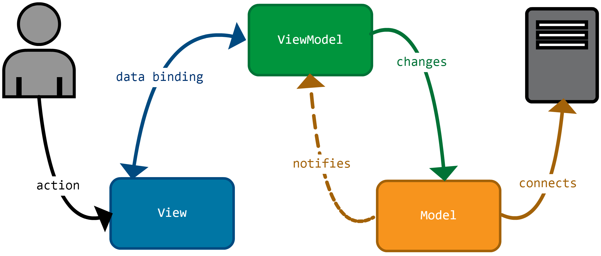

# **WPF - Windows Presentation Foundation**
# 🚩 Objectifs
- Apprendre les bases de WPF.
- MVVM
- Pratiquer les bases de XML avec un projet Dashboard avec système de navigation.

# **📖 Theorie :**

## Qu'est-ce que WPF ❓
WPF (Windows Presentation Foundation) est un framework développé par Microsoft pour la création d'applications de bureau sous Windows. Il permet de concevoir des interfaces utilisateur modernes et interactives en utilisant XAML pour la définition des interfaces et C# pour la logique métier. WPF offre des fonctionnalités avancées telles que :

- **Séparation du code et de l'interface** grâce à XAML.
- **Prise en charge du binding de données** pour faciliter la gestion des interfaces dynamiques.
- **Graphismes avancés** avec le support du rendu 2D et 3D.
- **Système de styles et de templates** pour personnaliser les contrôles UI.
- **Gestion fluide des animations et des effets visuels**.
- **Support de MVVM (Model-View-ViewModel)**, une architecture permettant une meilleure séparation des préoccupations.

## 📂 Structure d'un projet WPF
- Lors de la création d'un projet WPF dans Visual Studio, la structure suivante est générée :
### generale view 🧐
```
C:.
└─── WPF_Project
    ├─── WPF_Project :  contient tout le code, les fichiers XAML et les autres ressources que Visual Studio utilise pour construire l'application.
    │   
    └─── WPF_Project.sln : la solution Visual Studio pour ouvrir et gérer l'ensemble du projet WPF.(la plupart du temps on l'ouvre en premier et on travail dedans) 
```
### ‼️np: **.vs/ c'est un dossier qui contient ...! ignore dans .ignore 📍**

### WPF_Project.sln
```
WPF_Project.sln 
        ├─── dependencies
        │   
        │─── app.xml 
        │       │─── app.cs : le premiere file qui se lance (lentree de lapplication, il lance MainWindow )
        │
        │── AssemblyInfo.cs
        │
        └─── MainWindow.xaml : on peut dire que c'est le fichier html de l'application 
                │─── MainWindow.cs : logique de MainWindow
```

# Concepts Clés de WPF 🔑

## 📌 XAML (Extensible Application Markup Language)
- Langage déclaratif pour définir l'interface utilisateur en WPF.


## 🎨 Styles
- Centralisent l'apparence des contrôles pour une cohérence visuelle ; Utilisation de `Resources` et `StaticResource/DynamicResource`.

## 💻 Code-behind
- Logique C# associée à un fichier XAML, À utiliser avec modération pour respecter l'architecture MVVM !

## 🏗 Architecture MVVM (Model-View-ViewModel)
Patron de conception dérivé de MVC, spécialement adapté pour WPF :
                                                               
 **Model** : Données et logique métier (C#), Le Modèle communique avec le serveur et notifie le ViewModel de son changement.                                                      
 **View** : Interface utilisateur (XAML), La Vue reçoit toujours les actions de l’utilisateur et interagit seulement avec le ViewModel.                              
 **ViewModel** Intermédiaire entre View et Model :                                 
- Implémente `INotifyPropertyChanged`                                
- Expose les commandes (ICommand) 
- Gère la validation des données                                     
- Écoute les événements du Model                                     
- présenter les données du Model à la Vue                                   

‼️l'ajout des autres packages (commandes, services, exeptions . . . ) ne foire pas le model MVVM



## 📊 Liaison de Données (Data Binding)
### **0. Definition **

Le Data Binding est un processus qui relie les données de l'application à l'interface utilisateur (UI). Cela permet que quand les données changent, l'UI se mette à jour automatiquement. Inversement, quand un utilisateur modifie l'UI, les données sont mises à jour.

🔹 Modes de Liaison de Données :
OneWay :

Les données sont mises à jour dans l'UI uniquement.

Exemple : Afficher des informations, mais ne pas les modifier.

TwoWay :

Les données sont mises à jour dans l'UI et vice-versa.

Exemple : Modifier une valeur dans une TextBox, et voir cette valeur se refléter dans les données.

OneTime :

Les données sont liées une seule fois au démarrage, sans mise à jour automatique.

Exemple : Afficher un message fixe sans changer.

### **1. concepts et mécanismes** qui jouent un rôle dans le **Data Binding** : 

### **1.1 `INotifyPropertyChanged`**
- **Rôle** : Permet aux objets de notifier automatiquement l'interface utilisateur lorsqu'une propriété change.
- **Utilisation** : Implémenté dans les classes de données (souvent dans le ViewModel en MVVM) pour informer la vue des modifications.
  
Exemple :
```csharp
public class Person : INotifyPropertyChanged
{
    private string _name;
    public string Name
    {
        get { return _name; }
        set
        {
            if (_name != value)
            {
                _name = value;
                OnPropertyChanged(nameof(Name));
            }
        }
    }

    public event PropertyChangedEventHandler PropertyChanged;
    protected virtual void OnPropertyChanged(string propertyName)
    {
        PropertyChanged?.Invoke(this, new PropertyChangedEventArgs(propertyName));
    }
}
```

---

### **2. `DataContext`**
- **Rôle** : Définit la source de données pour un contrôle ou une fenêtre.
- **Utilisation** : Le `DataContext` d'un contrôle est souvent défini comme un **ViewModel** ou un objet de données. Ce `DataContext` est utilisé par tous les contrôles enfants pour la liaison de données.

Exemple :
```csharp
public MainWindow()
{
    InitializeComponent();
    this.DataContext = new Person { Name = "Alice" }; // Lier les données à la fenêtre
}
```

---

### **3. `Binding`**
- **Rôle** : Le mécanisme principal pour relier un contrôle à une propriété de données.
- **Utilisation** : Dans le XAML, la balise **`Binding`** est utilisée pour lier une propriété d'un contrôle à une propriété du `DataContext`.

Exemple de liaison d'une propriété `Text` à une propriété `Name` :
```xml
<TextBlock Text="{Binding Name}" />
```

---

### **4. `ObservableCollection<T>`**
- **Rôle** : Une collection qui notifie automatiquement l'interface utilisateur lorsque des éléments sont ajoutés, supprimés ou modifiés.
- **Utilisation** : Utile pour lier des listes dynamiques dans l'interface utilisateur, comme des éléments dans une **ListBox** ou un **DataGrid**.

Exemple :
```csharp
public ObservableCollection<Person> People { get; set; } = new ObservableCollection<Person>();
```

---

### **5. `DependencyProperty`**
- **Rôle** : Une propriété spéciale utilisée dans les contrôles pour offrir des fonctionnalités avancées de liaison de données, comme la gestion des mises à jour de l'UI.
- **Utilisation** : Elle est principalement utilisée dans les **contrôles personnalisés**. Les `DependencyProperty` permettent des mécanismes comme l'animation, la mise à jour automatique et la gestion de la mémoire.

Exemple :
```csharp
public static readonly DependencyProperty NameProperty =
    DependencyProperty.Register("Name", typeof(string), typeof(MyControl));

public string Name
{
    get { return (string)GetValue(NameProperty); }
    set { SetValue(NameProperty, value); }
}
```

---

### **6. `IValueConverter`**
- **Rôle** : Permet de transformer les données avant de les afficher dans l'interface utilisateur.
- **Utilisation** : Les convertisseurs sont utilisés pour des cas comme la conversion de types (ex. : transformer une valeur booléenne en une chaîne "Oui"/"Non") ou la modification du format d'affichage.

Exemple de `IValueConverter` :
```csharp
public class UpperCaseConverter : IValueConverter
{
    public object Convert(object value, Type targetType, object parameter, CultureInfo culture)
    {
        return value.ToString().ToUpper();
    }

    public object ConvertBack(object value, Type targetType, object parameter, CultureInfo culture)
    {
        return value.ToString().ToLower();
    }
}
```

Et dans XAML :
```xml
<TextBlock Text="{Binding Name, Converter={StaticResource UpperCaseConverter}}" />
```

---

### **7. `Command` et `ICommand`**
- **Rôle** : Permet d'associer des actions (comme des clics de boutons) à des méthodes dans le ViewModel ou le code-behind.
- **Utilisation** : Utilisé pour implémenter des actions dans une application MVVM sans avoir à lier directement des événements dans le code-behind.

Exemple :
```xml
<Button Command="{Binding SaveCommand}" Content="Save"/>
```

Dans le `ViewModel`, `SaveCommand` serait une instance d'une classe qui implémente `ICommand` (souvent `RelayCommand` ou `DelegateCommand`).

---

### **8. `BindingMode`**
- **Rôle** : Définit la direction dans laquelle les données sont synchronisées entre l'objet source et l'interface utilisateur.
- **Utilisation** : Les principaux modes sont :
  - **OneWay** : De l'objet source vers l'UI.
  - **TwoWay** : De l'objet source vers l'UI et vice versa.
  - **OneTime** : Une seule fois au démarrage.
  - **OneWayToSource** : De l'UI vers l'objet source.

Exemple :
```xml
<TextBox Text="{Binding Name, Mode=TwoWay}" />
```

---

### **9. `ElementName` Binding**
- **Rôle** : Permet de lier une propriété d’un contrôle à celle d'un autre contrôle dans le même contexte.
- **Utilisation** : Par exemple, lier la valeur d'un `TextBox` à un autre `TextBox` ou contrôle.

Exemple :
```xml
<TextBox x:Name="myTextBox" Text="Hello World"/>
<TextBlock Text="{Binding Text, ElementName=myTextBox}" />
```

---

### **10. `VisualTree` et `LogicalTree`**
- **Rôle** : Les arbres visuels (VisualTree) et logiques (LogicalTree) représentent la hiérarchie des éléments dans l'interface utilisateur. Parfois, tu peux lier un contrôle à un autre élément basé sur leur position dans ces arbres.

---

### **11. `MultiBinding`**
- **Rôle** : Permet de lier plusieurs sources de données à un seul contrôle.
- **Utilisation** : Par exemple, afficher une valeur composée de plusieurs propriétés liées.

Exemple :
```xml
<TextBlock>
    <TextBlock.Text>
        <MultiBinding StringFormat="{}{0} - {1}">
            <Binding Path="FirstName"/>
            <Binding Path="LastName"/>
        </MultiBinding>
    </TextBlock.Text>
</TextBlock>
```

---

### **En résumé :**
Voici un aperçu des **concepts et mécanismes** clés dans le Data Binding en WPF :
- **`INotifyPropertyChanged`** : Notifie les changements de données.
- **`DataContext`** : Source des données pour les contrôles.
- **`Binding`** : Relie les propriétés de données aux contrôles UI.
- **`ObservableCollection<T>`** : Collection qui notifie l'UI des changements.
- **`DependencyProperty`** : Propriétés avancées pour les contrôles personnalisés.
- **`IValueConverter`** : Permet de transformer les valeurs liées.
- **`Command` et `ICommand`** : Permet de lier des actions aux événements.
- **`BindingMode`** : Définit la direction de la synchronisation des données.
- **`ElementName` Binding** : Permet de lier des contrôles entre eux.
- **`VisualTree` et `LogicalTree`** : Hiérarchie des éléments UI.
- **`MultiBinding`** : Lie plusieurs sources à un seul contrôle.

Ces mécanismes permettent de rendre l'interface utilisateur réactive et de faciliter la séparation des préoccupations dans les applications WPF.
## Navigation
## DependencyInjection
L'Injection de Dépendances (DI) est un principe fondamental de l’Inversion de Contrôle (IoC) qui permet de découpler les composants d'une application en injectant leurs dépendances plutôt que de les instancier directement;  Avec l’injection de dépendances (DI), ce n’est pas la classe qui crée ses propres dépendances, mais un autre composant (le conteneur d’injection) qui se charge de leur création et de leur gestion.

En WPF, on utilise Microsoft.Extensions.DependencyInjection pour gérer les dépendances et on configure cela généralement dans App.xaml.cs.

📌 Le ServiceProvider : Une Boîte à Outils Intelligente 🧰
Le ServiceProvider est un conteneur qui stocke et fournit les instances des services dont l’application a besoin.

🛠️ Explication du Processus
Configuration des services dans App.xaml.cs :

On construit un ServiceProvider qui servira de boîte à outils qui utilise ServiceCollection pour enregistrer les services.
📊 Tableau Récapitulatif
Type d’enregistrement	Durée de vie	Partage entre utilisateurs ?	Exemple d’utilisation
AddSingleton	Toute la durée de vie de l’application	✅ Oui	Logger, Configuration, API Client
AddScoped	Une instance par requête	🚫 Non (sauf pour une même requête)	Gestion des utilisateurs, DbContext
AddTransient	Une instance à chaque demande	🚫 Non	Service de mail, Générateur de rapports
ensuite les injecter via la fonctuin startup 

### 📚 Ressources Recommandées
- Tutoriel MVVM  : [japf.developpez.com](https://japf.developpez.com/tutoriels/dotnet/mvvm-pour-des-applications-wpf-bien-architecturees-et-testables/#LIV)
- Playlist XML (niveau débutant, en arabe) : [Xml](https://www.youtube.com/playlist?list=PLjTzpE6cvFakLb80cpN-9vUcGgL_BbOPI) (utile pour les bases avant WPF)
- youtube mvvm : [MVVM](https://www.youtube.com/playlist?list=PLA8ZIAm2I03hS41Fy4vFpRw8AdYNBXmNm)

##  Projet Pratique
**Exemple à réaliser** :  
📌 Créer un *Dashboard avec système de navigation* pour appliquer ces concepts.  
→ Commencer par un design simple en XAML avant d'implémenter le Data Binding et MVVM.

# **practice : Dashboard Project 🧮**
## Objectif 
- Pratiquer les bases de WPF et de la liaison de données.
- Comprendre la structure d'un projet WPF et la séparation des préoccupations.
- Utiliser les contrôles de base de WPF (Button, TextBox, etc.).
- Gérer les événements utilisateur (clic de bouton).
- Personnaliser l'interface utilisateur avec des styles et des templates.
- Utiliser MVVM pour séparer la logique métier de l'interface utilisateur.

## creer le projet 
- Ouvrir Visual Studio et créer un nouveau projet WPF.
- Nommer le projet "Dashboard" et choisir un emplacement pour enregistrer le projet.
- Sélectionner le framework .NET Core ou .NET Framework selon vos préférences.
- Cliquer sur "Create" pour générer le projet.
- Visual Studio crée automatiquement une fenêtre principale (MainWindow.xaml) et un fichier de code-behind (MainWindow.xaml.cs).
ou utiliser la ligne des commande et taper : 
```bash
dotnet new wpf -n Dashboard
```

## Structure du Projet
```
C:.
└─── Dashboard
    ├─── Dashboard : Le dossier Dashboard contient tout le code, les fichiers XAML et les autres ressources que Visual Studio utilise pour construire l'application.
    │   
    └─── Dashboard.sln : Le fichier .sln est l'entrée principale dans Visual Studio pour ouvrir et gérer l'ensemble du projet Dashboard.
```
## go on to Dashboard.sln and create your app check the code source 

   
## Conclusion
WPF est un framework puissant et flexible pour le développement d'applications de bureau sous Windows. Il offre une architecture moderne, une séparation claire entre la logique métier et l'interface utilisateur, ainsi que de nombreuses fonctionnalités avancées. Ce projet de calculatrice est une excellente manière de se familiariser avec les bases de WPF et du langage XAML.

# XML Language 
- Youtube links 🔗  for xml en arabe (lvl 0) : https://www.youtube.com/playlist?list=PLjTzpE6cvFakLb80cpN-9vUcGgL_BbOPI (playlist pour android vous, voir que les video xml)
# WPF youtube links : 
wpf For beginner (lvl 0) : https://www.youtube.com/playlist?list=PLhiFu-f80eo_G_vy3chqA7ClqVUvohs8N
WPF tuto (lvl 1): https://www.youtube.com/playlist?list=PLih2KERbY1HHOOJ2C6FOrVXIwg4AZ-hk1
crud : https://www.youtube.com/watch?v=8xPzjYBYu-M&list=PL7FAIXDZVr6ZyrYGS-SjrXrhz8Ut52xPO&ab_channel=VetrivelD
MVVM : https://www.youtube.com/watch?v=i_DlDYFR0Ag&list=PLEGjYQQO3ST8hatajWNDUGVwo437sPv8G&ab_channel=TechieSyed